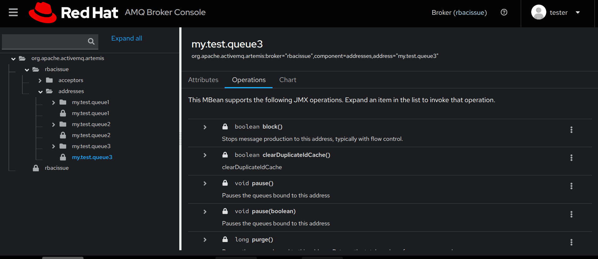
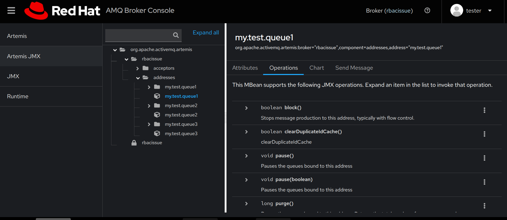

. With this security settings the lock appears on all addresses:

````
<security-settings>
    <security-setting match="DLQ">
        <permission roles="admin,tester" type="send"/>
        <permission roles="admin" type="consume"/>
        <permission roles="admin,tester" type="browse"/>
    </security-setting>
    <security-setting match="mops.#">
        <permission roles="admin,tester" type="view"/>
        <permission roles="admin" type="edit"/>
    </security-setting>
    <security-setting match="mops.queue.#">
        <permission roles="admin" type="view"/>
        <permission roles="admin" type="edit"/>
    </security-setting>
    <security-setting match="mops.address.#">
        <permission roles="admin" type="view"/>
        <permission roles="admin" type="edit"/>
    </security-setting>
    <security-setting match="mops.*.DLQ.#">
        <permission roles="admin" type="view"/>
        <permission roles="admin" type="edit"/>
    </security-setting>
    <security-setting match="mops.*.ExpiryQueue.#">
        <permission roles="admin" type="view"/>
        <permission roles="admin" type="edit"/>
    </security-setting>
      <security-setting match="mops.mbeanserver.queryNames">
        <permission roles="admin,tester" type="view"/>
        <permission roles="admin" type="edit"/>
    </security-setting>
    <security-setting match="mops.*.activemq.notifications.#">
        <permission roles="admin" type="view"/>
        <permission roles="admin" type="edit"/>
    </security-setting>
    <security-setting match="mops.*.my.test.queue1#">
        <permission roles="admin,tester" type="view"/>
        <permission roles="admin" type="edit"/>
    </security-setting>
    <security-setting match="mops.*.my.test.queue2#">
        <permission roles="admin,tester" type="view"/>
        <permission roles="admin" type="edit"/>
    </security-setting>
    <security-setting match="mops.*.my.test.queue3#">
        <permission roles="admin,tester" type="view"/>
        <permission roles="admin,tester" type="edit"/>
    </security-setting>
    <security-setting match="mops.*.my.test.queue4#">
        <permission roles="admin" type="view"/>
        <permission roles="admin" type="edit"/>
    </security-setting>
    <security-setting match="my.test.queue1">
        <permission roles="admin,tester" type="send"/>
        <permission roles="admin" type="consume"/>
        <permission roles="admin,tester" type="browse"/>
    </security-setting>
</security-settings>
````




If the role tester is granted the edit permission, the lock is removed from all addresses

   <security-setting match="mops.*.my.test.queue1#">
        <permission roles="admin,tester" type="view"/>
        <permission roles="admin,tester" type="edit"/>
    </security-setting>


